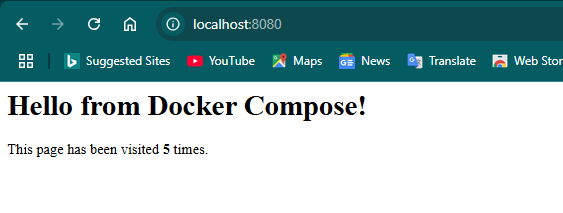

# 🐳 Docker Compose Three-Tier Application

A hands-on DevOps project demonstrating how to build, containerize, and orchestrate a three-tier web application using Docker Compose.

The application consists of an **Nginx reverse proxy**, a **Python Flask application**, and a **MySQL database**, with private container networking, environment-based configuration, and persistent database storage.



---

## 📌 Overview

This project builds upon basic Docker containerization by introducing a multi-container architecture managed with Docker Compose.

The application is separated into three logical tiers:

```text
    Browser
    │
    │ localhost:**8080**
    ▼
    ┌───────────────┐
    │     Nginx     │
    │ Presentation  │
    │     Layer     │
    └───────┬───────┘
    │
    │ app:**5000**
    ▼
    ┌───────────────┐
    │ Python Flask  │
    │ Application   │
    │     Layer     │
    └───────┬───────┘
    │
    │ database:**3306**
    ▼
    ┌───────────────┐
    │     MySQL     │
    │   Data Layer  │
    └───────┬───────┘
    │
    ▼
    mysql_data
    Named Volume

Only Nginx is exposed to the host machine. The Flask application and MySQL database communicate internally through the Docker Compose network.

🎯 Project Objectives

The project was designed to provide practical experience with:

### Docker Compose

Multi-container applications
Three-tier architecture
Docker networking
Container-to-container communication
Nginx reverse proxying
### Python Flask
MySQL
Environment variables
Docker named volumes
Persistent application data
Container lifecycle management
Docker troubleshooting
Linux / **WSL**
Git and GitHub
🛠️ Technologies
Technology	Purpose
Docker	Containerization
Docker Compose	Multi-container orchestration
Nginx	Reverse proxy / presentation layer
Python	Application development
Flask	Web application framework
MySQL 8.4	Database
Git	Version control
GitHub	Source control and project hosting
Ubuntu / **WSL**	Development environment
🏗️ Architecture

The application follows a three-tier architecture.

### Presentation Layer

Nginx

Nginx is the public-facing component of the application. It receives **HTTP** requests from the browser and forwards them to the Flask application.

Host port **8080**
    │
    ▼
Nginx port 80
### Application Layer

### Python Flask

The Flask application contains the application logic and communicates with MySQL.

It listens internally on port **5000** and is not directly exposed to the host.

Nginx
    │
    ▼
app:**5000**
### Data Layer

MySQL

MySQL stores the application's persistent data.

It listens internally on port **3306**.

Flask
    │
    ▼
database:**3306**
📂 Project Structure
docker-compose-app/
│
├── app/
│   ├── Dockerfile
│   └── app.py
│
├── nginx/
│   └── default.conf
│
├── images/
│   ├── appfoldercreated.png
│   ├── catapp.py1.png
│   ├── catapp.py2.png
│   ├── curl-database.png
│   ├── curl-localhost.png
│   ├── default.conf-image.png
│   ├── directory-setup.png
│   ├── dockerbuild-app.png
│   ├── dockercompose-downandup.png
│   ├── dockercompose-execweb.png
│   ├── dockercompose-psandvolumels.png
│   ├── dockercompose-upandps.png
│   ├── dockercompose-version.png
│   ├── dockercompose-volumermandls.png
│   ├── dockercomposeappandps.png
│   ├── dockerfile.png
│   ├── dockernetwork-inspect1.png
│   ├── dockernetwork-inspect2.png
│   ├── dockernetwork-list.png
│   ├── failedlocalhost3306-attempt.png
│   ├── localhost8080success.png
│   ├── mounts.png
│   ├── perssistence-volume.png
│   ├── sudocomposepsfinal.png
│   └── webpagesuccess.png
│
├── .env.example
├── .gitignore
├── compose.yaml
└── **README**.md
🚀 Building the Application
## Creating the Project Directory

The project was created inside my DevOps projects directory.

cd ~/devops-projects mkdir docker-compose-app cd docker-compose-app

The initial project directory was intentionally kept empty before the application components were created.

🐍 2. Creating the Flask Application

The application layer was implemented using Python and Flask.

The Flask application provides a simple webpage and keeps track of how many times the page has been visited.

The application uses environment variables for its database configuration instead of hard-coding database credentials.

The database host is specified using the Docker Compose service name:

database

This allows Docker's internal **DNS** to resolve the MySQL container automatically.

🐳 3. Containerizing the Flask Application

A Dockerfile was created inside the app/ directory.

The Dockerfile defines the Python environment, copies the application code into the image, installs the required dependencies, and starts the Flask application.

The image was then built with Docker.

🌐 4. Configuring Nginx

Nginx was selected as the presentation layer and reverse proxy.

A custom Nginx configuration was created in:

nginx/default.conf

The purpose of the configuration is to forward requests received by Nginx to the Flask application.

The request flow therefore becomes:

Browser
    │
    ▼
Nginx
    │
    ▼
Flask

The browser does not need to communicate directly with the Flask application.

⚙️ 5. Docker Compose Configuration

Docker Compose was used to define and orchestrate the three services.

The final compose.yaml contains:

services:
    web:
    image: nginx:1.29.1
    ports:
    - ***8080**:80*
    volumes:
    - ./nginx/default.conf:/etc/nginx/conf.d/default.conf:ro

    app:
    build: ./app
    environment:
    MYSQL_USER: ${MYSQL_USER}
    MYSQL_PASSWORD: ${MYSQL_PASSWORD}
    MYSQL_DATABASE: ${MYSQL_DATABASE}

    database:
    image: mysql:8.4
    environment:
    MYSQL_ROOT_PASSWORD: ${MYSQL_ROOT_PASSWORD}
    MYSQL_DATABASE: ${MYSQL_DATABASE}
    MYSQL_USER: ${MYSQL_USER}
    MYSQL_PASSWORD: ${MYSQL_PASSWORD}
    volumes:
    - mysql_data:/var/lib/mysql

volumes: mysql_data:

This configuration defines:

The Nginx web service The Flask application service The MySQL database service The Docker network created automatically by Compose The persistent MySQL volume Environment variables used by the application and database 🔐 6. Environment Variables

Database credentials are stored in a .env file rather than directly inside compose.yaml.

The .env file contains values corresponding to:

MYSQL_DATABASE=your_database_name MYSQL_USER=your_database_user MYSQL_PASSWORD=your_database_password MYSQL_ROOT_PASSWORD=your_root_password

The real .env file is excluded from Git using .gitignore.

A .env.example file is included in the repository to document the required variables without exposing the actual credentials.

.env
    │
    ├── Contains real credentials
    └── Excluded from Git

.env.example
    │
    ├── Contains variable names / placeholders
    └── Safe to commit

This separation prevents sensitive credentials from being accidentally pushed to GitHub.

🔗 7. Docker Compose Networking

Docker Compose automatically creates a private network for the services.

The services can communicate with one another using their service names.

For example:

app → database:**3306**

The Flask application does not need to know the IP address of the MySQL container.

Docker's internal **DNS** resolves:

database

to the correct container.

The network can be viewed with:

sudo docker network ls

The network configuration can also be inspected:

sudo docker network inspect docker-compose-app_default

🔌 8. Understanding Public and Internal Ports

One of the major concepts demonstrated by this project is the difference between a published host port and an internal container port.

Nginx is configured as:

ports: - ***8080**:80*

This means:

Host
localhost:**8080**
    │
    ▼
Container
Nginx:80

Therefore, the application can be accessed from the host using:

[http://localhost:**8080**](http://localhost:**8080**)

However, the Flask service is not published to the host:

**5000**/tcp

and MySQL is also not published:

**3306**/tcp

These ports are available for communication inside the Docker network but are not directly exposed to the host.

This creates a useful separation:

    **PUBLIC**
    │
    ▼
    localhost:**8080**
    │
    ▼
    Nginx
    │
    **PRIVATE** **NETWORK**
    │
    ┌────────┴────────┐
    ▼                 ▼
    Flask              MySQL
    :**5000**               :**3306**
🧪 9. Testing Internal Connectivity

Container-to-container communication was tested using Docker's internal network.

The database can be reached using its service name rather than localhost.

An attempt to access MySQL through the host's localhost:**3306** was unsuccessful because the database port was not published to the host.

This demonstrated the difference between:

database:**3306**

and:

localhost:**3306**

The first refers to the MySQL service from within the Docker network.

The second refers to port **3306** on the host machine.

They are not the same thing.

▶️ 10. Starting the Application

The complete application stack can be started with:

sudo docker compose up -d

The -d flag runs the containers in detached mode.

The running services can be viewed with:

sudo docker compose ps

The services are:

app database web 🔍 11. Inspecting the Application

Docker Compose provides several useful commands for inspecting the application.

View running services:

sudo docker compose ps

View all containers:

sudo docker compose ps -a

View the Compose project:

sudo docker compose ls

Validate the Compose configuration:

sudo docker compose config

View service logs:

sudo docker compose logs

View logs for a specific service:

sudo docker compose logs app sudo docker compose logs web sudo docker compose logs database 💾 12. Persistent Database Storage

The MySQL service uses a named Docker volume:

volumes: - mysql_data:/var/lib/mysql

The volume allows MySQL data to survive container recreation.

The volume can be viewed with:

sudo docker volume ls

The volume configuration was inspected to understand how Docker maps persistent storage into the MySQL container.

♻️ 13. Testing Persistence

A key part of the project was verifying that database data survives the removal and recreation of containers.

The application stack was removed with:

sudo docker compose down

This removes the containers and network but does not remove the named volume by default.

The application was then recreated:

sudo docker compose up -d

Because the MySQL data was stored in the named mysql_data volume, the database persisted across the container lifecycle.

This demonstrates an important Docker concept:

Containers = Disposable Data      = Persistent

The named volume deliberately separates application data from the lifecycle of the MySQL container.

🌍 14. Testing the Complete Application

The final application can be tested from the host with:

curl [http://localhost:**8080**](http://localhost:**8080**)

The browser can also access:

[http://localhost:**8080**](http://localhost:**8080**)

The application displays the page and tracks the number of visits using the MySQL database.

The final container state was verified with Docker Compose:

🔄 Complete Request Flow

The complete request lifecycle is:

    Browser
    │
    │ **HTTP** :**8080**
    ▼
    ┌───────────────┐
    │     Nginx     │
    │      :80      │
    └───────┬───────┘
    │
    │ **HTTP**
    ▼
    ┌───────────────┐
    │    Flask      │
    │     :**5000**     │
    └───────┬───────┘
    │
    │ MySQL
    ▼
    ┌───────────────┐
    │     MySQL     │
    │     :**3306**     │
    └───────────────┘
    │
    ▼
    mysql_data

Only the first connection crosses from the host into the Docker environment:

localhost:**8080** → Nginx:80

The remaining communication occurs inside the Docker network:

Nginx → app:**5000** app   → database:**3306** 🧹 Container Lifecycle

Docker Compose was also used to practice the complete lifecycle of a multi-container application.

Start sudo docker compose up -d Check status sudo docker compose ps View logs sudo docker compose logs Stop and remove containers sudo docker compose down Rebuild and start sudo docker compose up -d --build

This workflow makes it possible to repeatedly build, test, destroy, and recreate the application stack.

🧠 Key Lessons

This project provided practical experience with:

### Docker Compose

Defining multiple services
Building custom images
Pulling existing images
Managing containers as a single application
Using Compose lifecycle commands
Networking
Docker bridge networks
Container-to-container communication
Docker's internal **DNS**
Service-name based communication
Internal versus published ports
### Reverse Proxying
Nginx as a reverse proxy
Separating the public-facing layer from the application layer
Forwarding requests between containers
Storage
Named Docker volumes
Persistent database storage
Container lifecycle versus data lifecycle
Anonymous versus named volumes
Security and Configuration
Environment variables
.env
.env.example
.gitignore
Avoiding hard-coded credentials
Keeping database services private
Troubleshooting
Inspecting containers
Reading Docker Compose logs
Inspecting networks
Inspecting volumes
Testing internal connectivity
Understanding port mappings
📋 Useful Commands
Command	Purpose
sudo docker compose up -d	Start the application
sudo docker compose up -d --build	Rebuild images and start
sudo docker compose down	Stop and remove containers/network
sudo docker compose ps	Show running services
sudo docker compose ps -a	Show all service containers
sudo docker compose ls	List Compose projects
sudo docker compose logs	View logs
sudo docker compose config	Validate/render Compose configuration
sudo docker network ls	List Docker networks
sudo docker network inspect	Inspect a network
sudo docker volume ls	List Docker volumes
sudo docker volume inspect	Inspect a volume
curl [http://localhost:**8080**](http://localhost:**8080**)	Test the application
🏁 Conclusion

This project demonstrates how a simple Dockerized application can be expanded into a multi-container architecture using Docker Compose.

The final architecture separates the application into:

Nginx ↓ Flask ↓ MySQL

while using:

Docker Compose networking for internal communication Nginx for public access and reverse proxying Environment variables for configuration A named volume for persistent database storage

The result is a reproducible three-tier application that can be started, stopped, rebuilt, inspected, and recreated using Docker Compose.

👩🏽‍💻 Author

### Benita Adakeja

Computer Science Student | DevOps & Cloud Enthusiast

📄 License

This project is licensed under the **MIT** License.
